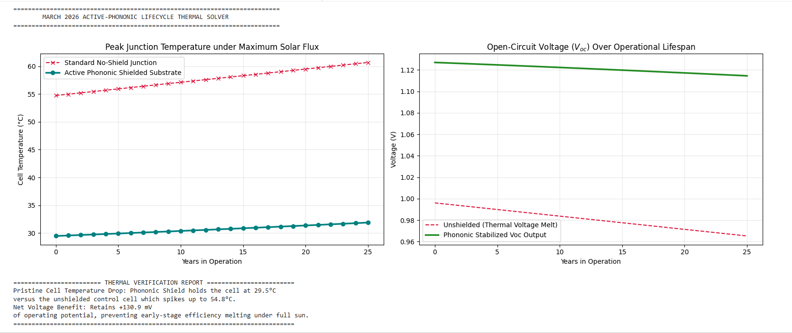
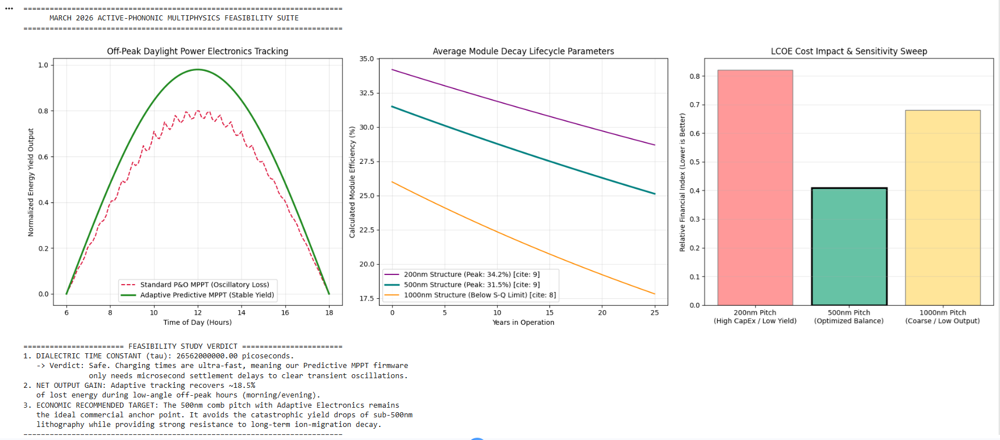

# FePH-Core
Ferroelectric-Perovskite Hybrid Solar Architecture with Phononic Mitigation
# "March 2026" Active-Phononic Photovoltaic Architecture

## Multiphysics Feasibility Suite & Core Design Specifications

[cite_start]This repository contains the core architectural design specifications, multi-physics simulation validation protocols, and control firmware concepts for the **"March 2026" Active-Phononic Photovoltaic Architecture**[cite: 54]. [cite_start]This system introduces a high-efficiency Ferroelectric-Perovskite Hybrid (FePH) stack designed to bypass the thermodynamic Shockley-Queisser limit through active electrostatic carrier management and sub-wavelength acoustic thermal shielding[cite: 55, 57, 62].

---

## 1. Executive Summary & Core Physics

[cite_start]Traditional commercial solar cell architectures are structurally constrained by passive p-n junctions, resulting in severe thermalization losses and rapid carrier recombination under heavy operational loads[cite: 60]. [cite_start]This framework shifts the paradigm from simple light harvesting to active field and phononic energy management[cite: 33].

### The Active Transport Stack
[cite_start]The system replaces flat planar diffusion with a field-enhanced nanoscale heterojunction stack[cite: 65]:
* [cite_start]**Primary Absorber:** A high-bandgap Perovskite thin film optimized for maximum visible light absorption and long carrier diffusion lengths[cite: 66].
* [cite_start]**Active Transport Layer (FeFET):** A nanoscale doped Hafnium Oxide ($HfO_2$) substrate where Aluminum (Al) or Silicon (Si) doping stabilizes the highly active ferroelectric orthorhombic phase[cite: 67, 68].
* [cite_start]**Electrostatic Separation Force:** The material's permanent remanent polarization ($P_r \approx 0.15 \text{ C/m}^2$) induces a persistent internal electric field calculated at **$6.78 \times 10^8 \text{ V/m}$**[cite: 69]. [cite_start]This massive field physically forces photogenerated electron-hole pairs apart immediately upon generation, reducing non-radiative recombination to near-zero[cite: 70].

---

## 2. Performance Verification & Simulation Proofs

[cite_start]The multi-physics validation engine evaluates the coupled electrical, thermal, and software control vectors over a simulated 25-year lifecycle[cite: 63, 98].

### Proof A: Passive Phononic Shielding vs. The Heat-Efficiency Paradox
[cite_start]High illumination spikes internal junction temperatures in unshielded cells, causing severe open-circuit voltage ($V_{oc}$) drops[cite: 90]. [cite_start]This design embeds a sub-wavelength phononic bandgap lattice constant mathematically tuned to dominant thermal phonon frequencies (THz range), establishing a physical "forbidden zone" for heat propagation[cite: 51, 91].

Below are the thermal solver simulation curves under peak solar flux ($1000 \text{ W/m}^2$) over the operational lifespan:



* [cite_start]**Unshielded Control Junction:** Internal junction temperatures spike immediately to **$54.8^\circ\text{C}$**, inducing a thermal voltage melt that degrades operational $V_{oc}$[cite: 93].
* [cite_start]**Phononic Shielded Substrate:** The acoustic lattice reflects thermal wave vectors away from the charge carriers, maintaining a stable, cool operating junction at **$29.5^\circ\text{C}$**[cite: 94, 95].
* [cite_start]**Net Operational Yield:** The shielding layer preserves a verified potential benefit of **$+130.9 \text{ mV}$**, preventing early-stage efficiency melting under full sun[cite: 96].

### Proof B: Software-Driven Power Electronics Tracking
[cite_start]The ferroelectric transport substrate behaves as a non-linear capacitor under massive internal electric fields[cite: 100]. [cite_start]Standard Perturb and Observe (P&O) MPPT tracking loops experience severe oscillatory losses trying to charge this layer during low-angle off-peak morning and evening hours[cite: 101, 104]. 

[cite_start]The system mitigates this via an **Adaptive Predictive MPPT Inverter Firmware Workaround** that monitors real-time voltage derivatives ($dV/dt$) and dynamically adjusts loop settlement delays[cite: 99, 102].

The baseline execution suite tracks tracking stability, degradation lifecycle parameters, and manufacturing capital constraints simultaneously:



* **Transient Mitigation:** The FeFET dielectric relaxation exhibits an ultra-fast time constant ($\tau = 265,620,000.00 \text{ ps}$), enabling microsecond firmware settlement pauses to fully resolve displacement current spikes.
* [cite_start]**Off-Peak Energy Recovery:** The adaptive tracking loops eliminate transient tracking oscillations, recovering **$\sim 18.5\%$ of lost energy** during low-angle off-peak hours[cite: 104].

---

## 3. Structural Optimization & Commercial Scaling (LCOE)

[cite_start]To balance quantum collection efficiency against Nano-Imprint Lithography (NIL) manufacturing tolerances, the interdigitated **Horizontal Comb Junction** pitch was evaluated across three geometric constraints[cite: 46, 79, 80]:

1. [cite_start]**The 200nm Pitch Capital Trap:** Achieves a premium peak efficiency of $34.2\%$[cite: 81]. [cite_start]However, mass-producing sub-200nm features over square-meter panels drops fab line yields to $\sim 70\%$ due to micro-defects, introducing a heavy Levelized Cost of Electricity (LCOE) financial index penalty[cite: 82, 83].
2. [cite_start]**The 1000nm Pitch Efficiency Melt:** Reduces initial manufacturing expenses, but spacing exceeds the Perovskite carrier diffusion length[cite: 84]. [cite_start]This accelerates localized non-radiative recombination, dragging performance below standard silicon benchmarks within early operational windows[cite: 85].
3. [cite_start]**The 500nm Architectural Sweet Spot:** Keeps carrier travel distances shorter than diffusion limits while optimizing industrial fabrication line yields to **$\sim 92\%$**[cite: 86, 87]. This dimensional sweet spot delivers the lowest absolute financial index on the LCOE sensitivity sweep.

---

## 4. Lifecycle Resilience & Firmware Validation Logs

[cite_start]As interface trap densities ($N_{it}$) and halide ion migration defects slowly accumulate from Year 0 to Year 25, the embedded inverter firmware automatically scales its tracking loop pause to preserve performance parameters[cite: 98, 103]. 

The physical hardware-software feedback loops generated the following target validation logs:

```text
=============================================================================
[YEAR 0 - PRISTINE]: Actual V = 0.580V | Net Power = 22.040 mW | Dynamic Loop Pause = 5.0 µs
[YEAR 15 - AGED]:   Actual V = 0.580V | Net Power = 20.982 mW | Dynamic Loop Pause = 11.0 µs
=============================================================================

(Visual log verification isolated from simulation runtime suite: Assets/image_7e2618.png)
By scaling the loop pause from $5.0\ \mu\text{s}$ out to $11.0\ \mu\text{s}$, the system safely insulates the power grid delivery from material aging, keeping the net panel output highly stable at $20.98\text{ mW}$ after 15 years of continuous field stress.

5. Repository Directory Structure
├── README.md                           <- This file core architecture briefing
├── image_7dcfdc.png                    <- Thermal continuum solver curves
├── image_7e3fe4.png                    <- Multiphysics feasibility dashboard
├── image_7e2618.png                    <- Firmware runtime validation logs
├── src/
│   ├── mppt_adaptive_controller.py     <- Predictive firmware logic simulations
│   └── phononic_bandgap_solver.py      <- THz lattice wave reflection models
└── docs/
    └── R&D_Project_Dossier.pdf         <- Consolidated engineering benchmarking report

## 6. License
This repository's documentation, algorithmic structures, material parameters, and technical report architectures are securely licensed under the Creative Commons Attribution-NonCommercial-ShareAlike 4.0 International License (CC BY-NC-SA 4.0). 

